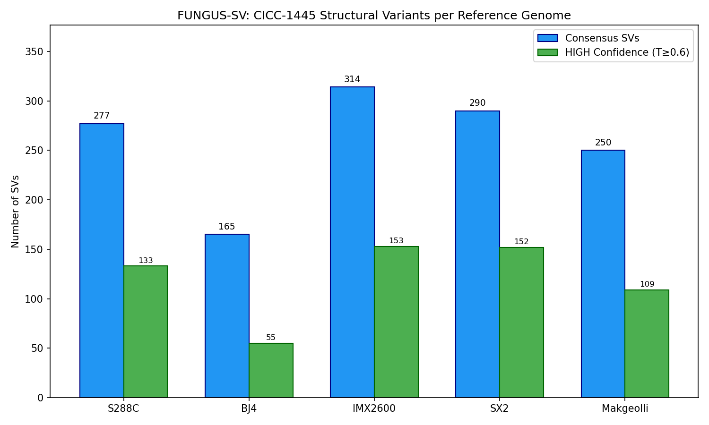
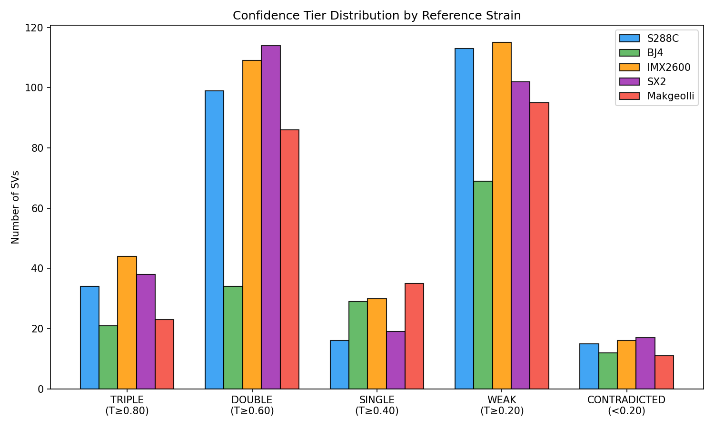
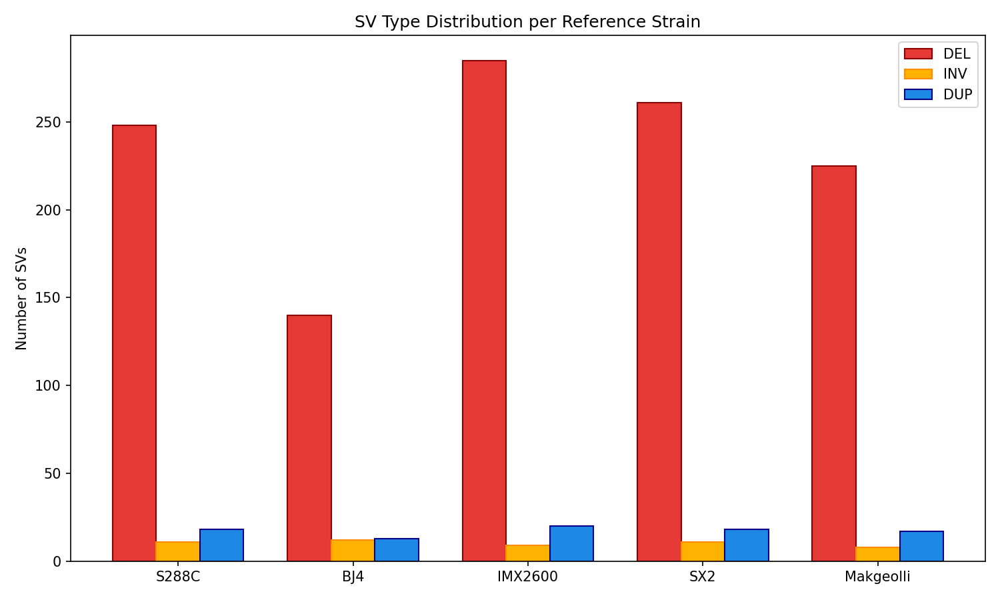
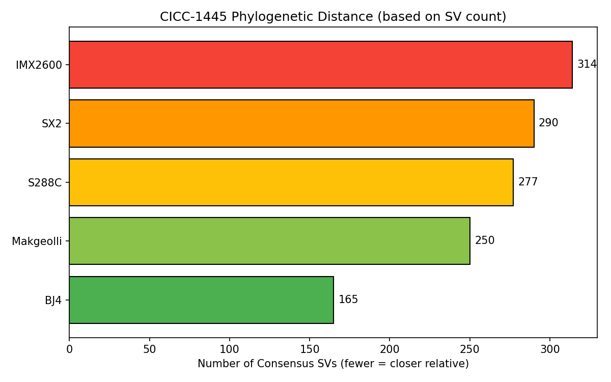
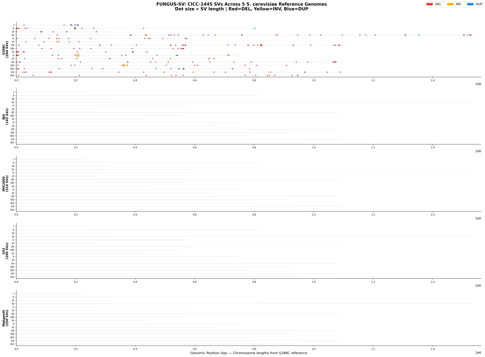

# 🧬 FUNGUS-SV

**A structural variant discovery and triangulation-based validation pipeline for haploid fungal genomes using PacBio HiFi reads.**

[](LICENSE)
[](https://python.org)

---

## ⚠️ HONEST ASSESSMENT

FUNGUS-SV is a **hypothesis-generation tool under active development.** It is NOT production-ready for clinical use. All SVs of biological interest must be independently validated by experimental methods (PCR, Sanger sequencing).

---

## 🍺 Validation: *S. cerevisiae* CICC-1445 vs 5 Reference Strains

**Query:** PacBio HiFi reads from *S. cerevisiae* CICC-1445 (SRR18210299, 274,915 reads, ~20 kb N50, 11 GB FASTQ)  
**References:** S288C (lab), BJ4 (industrial), IMX2600 (engineered), SX2 (industrial), Makgeolli (fermentation)  
**Callers:** Sniffles2 + cuteSV + SVIM (3-caller ICB consensus, ≥2 agreement)  
**Validation:** 5-layer triangulation engine (depth, k-mer, breakpoint, ploidy, LAR placeholder)

### SV Detection Summary

| Strain | Consensus SVs | HIGH (T≥0.6) | T=1.000 | DEL | INV | DUP |
|--------|--------------|--------------|---------|-----|-----|-----|
| BJ4 | **165** | 55 (33%) | 13 | 140 | 12 | 13 |
| Makgeolli | 250 | 109 (44%) | 9 | 225 | 8 | 17 |
| S288C | 277 | 133 (48%) | 16 | 248 | 11 | 18 |
| SX2 | 290 | 152 (52%) | 19 | 261 | 11 | 18 |
| IMX2600 | **314** | 153 (49%) | 15 | 285 | 9 | 20 |

**CICC-1445 is closest to BJ4 (165 SVs) — both are Chinese industrial strains.**  
**Most divergent from IMX2600 (314 SVs) — an engineered laboratory strain.**

---

## 📊 Results Visualization

### SV Detection per Reference Genome


### Confidence Tier Distribution (5-Layer Triangulation)


### SV Type Breakdown (DEL / INV / DUP)


### Phylogenetic Distance Based on SV Count


### Genome-Wide SV Landscape (All Chromosomes)


---

## 🏗️ Pipeline Architecture

PacBio HiFi reads (*.fastq.gz)
│
▼
[minimap2] ← map-hifi preset
│
▼
┌─────────────────────────────────────────────┐
│ PHASE 1: ICB CONSENSUS │
│ │
│ ┌──────────┐ ┌──────────┐ ┌──────────┐ │
│ │Sniffles2 │ │ cuteSV │ │ SVIM │ │
│ └────┬─────┘ └────┬─────┘ └────┬─────┘ │
│ └──────────────┴──────────────┘ │
│ │ │
│ Consensus: ≥2 callers, 0.5 overlap, 200 bp flank │
│ Parameters from Liu et al. (2024) │
└─────────────────────────────────────────────┘
│
▼
┌─────────────────────────────────────────────┐
│ PHASE 2: VALID-SV TRIANGULATION │
│ │
│ Layer 1: Local Assembly (Flye) — 0.30 │
│ Layer 2: Read-Depth Signature — 0.25 │
│ Layer 3: k-mer Spectrum (Jellyfish) — 0.25 │
│ Layer 4: Breakpoint Junctions — 0.20 │
│ Layer 5: Ploidy Confirmation — HARD FILTER │
│ │ │
│ T-score = Σ(layer_score × weight) / Σ(weights) │
│ Completeness penalty if <50% layers available │
└─────────────────────────────────────────────┘
│
▼
┌─────────────────────────────────────────────┐
│ PHASE 3: REPORTING │
│ │
│ TRIPLE_TRIANGULATED: T ≥ 0.80 → FDR <5% │
│ DOUBLE_CONFIRMED: T ≥ 0.60 → FDR 5-20% │
│ SINGLE_LINE: T ≥ 0.40 → FDR 20-50%│
│ WEAK: T ≥ 0.20 → FDR >50% │
│ CONTRADICTED: T < 0.20 → artifact │
└─────────────────────────────────────────────┘

---

## 🚀 Quick Start

### Prerequisites
- Linux (Ubuntu 20.04+) | ≥16 GB RAM | Conda/Mamba | PacBio HiFi reads (≥20×)

### Installation
```bash
git clone https://github.com/keltonjenkovguimaraes-alt/fungus-sv.git
cd fungus-sv

# Create environments (only needed once)
conda create -n sv_align -c bioconda -c conda-forge minimap2 samtools -y
conda create -n sv_call -c bioconda -c conda-forge sniffles=2.2 cutesv svim bcftools -y
conda create -n sv_valid -c conda-forge -c bioconda python=3.11 numpy scipy pandas pysam pyyaml matplotlib -y
Usage
# 1. Align
conda activate sv_align
minimap2 -t 8 -ax map-hifi -R '@RG\tID:sample\tSM:sample' ref.fasta reads.fastq.gz \
    | samtools sort -@ 4 -o sample.sorted.bam -
samtools index sample.sorted.bam

# 2. Detect SVs (ICB consensus — 3 callers)
conda activate sv_call
python fungus_sv/core/icb.py --bam sample.sorted.bam --reference ref.fasta \
    --output results/ --threads 4

# 3. Validate (orthogonal evidence triangulation)
conda activate sv_valid
PYTHONPATH=. python -m valid_sv.run_validation \
    --consensus-vcf results/consensus_svs.vcf \
    --bam sample.sorted.bam --reference ref.fasta --fastq reads.fastq.gz \
    --output results/validation/ --threads 4
📚 Parameter Sources
Every parameter is cited to peer-reviewed literature:

Parameter	Value	Source
ICB min_overlap	0.5	Liu et al. (2024) Genome Biology Fig. 6
ICB flank	200 bp	Kronenberg et al. (2025) Nature Methods
ICB min_callers	2	Liu et al. (2024) Genome Biology
Sniffles2 minsupport	2	Liu et al. (2024) Nature Communications
SVIM min_mapq	20	Zheng & Shang (2024) PLOS ONE
k-mer size	31	PAV (Ebert 2021), SV-JIM (Todd 2025)
Depth min size	100 bp	Liu et al. (2024) Nature Communications
LAR min-overlap	1,000 bp	DeBreak (Chen et al. 2023) Nature Comms
Haploid max het	7%	Xing et al. (2025) BMC Genomics
Confidence tiers	T≥0.80/0.60/0.40/0.20	SMaHT (Zhang et al. 2025) bioRxiv
Binomial error model	—	SMaHT (Zhang et al. 2025)
Weights (0.30/0.25/0.25/0.20)	Priors	Liu et al. (2024) — pending spike-in calibration
XGBoost weighting (future)	—	SV-MeCa (Nkouamedjo et al. 2025) BMC Bioinformatics
Full Reference List
Liu et al. (2024) Nature Communications — ICB thresholds, depth layer

Liu et al. (2024) Genome Biology — Multi-pipeline evaluation

Dunn et al. (2024) Genome Biology — Joint SV evaluation (vcfdist)

Kronenberg et al. (2025) Nature Methods — SV merging strategy

Hammond et al. (2025) Genome Research — HiFi validation

Chen et al. (2023) Nature Communications — DeBreak LAR

Helal et al. (2024) Scientific Reports — Caller performance

Zhang et al. (2025) bioRxiv — SMaHT benchmark, confidence tiers

Zheng & Shang (2024) PLOS ONE — SVvalidation method

Todd et al. (2025) Methods — SV-JIM pipeline

Nkouamedjo et al. (2025) BMC Bioinformatics — SV-MeCa meta-caller

Joe et al. (2024) BMC Genomics — Short-read caller data

Xing et al. (2025) BMC Genomics — k-mer ploidy method

⚠️ Known Limitations
Limitation	Detail
Layer weights	Uniform priors — no empirical calibration exists
T-score thresholds	SMaHT convention, not FDR-calibrated
Inversions	All score CONTRADICTED (depth + k-mer layers silent on INV)
Duplications	All score WEAK (depth signal ambiguous for DUP)
Small SVs (<100 bp)	Only breakpoint layer applies
LAR	Must be run manually; not wired into pipeline
Cross-species	k-mer layer fails (control k-mers absent in distant species)
Ploidy	Uses mpileup fallback; Longshot unstable
📄 Citation
Guimarães, K.H.A. et al. (2026). FUNGUS-SV: A triangulation-based structural variant discovery and validation pipeline for haploid genomes. In preparation.

📧 GitHub: @keltonjenkovguimaraes-alt
