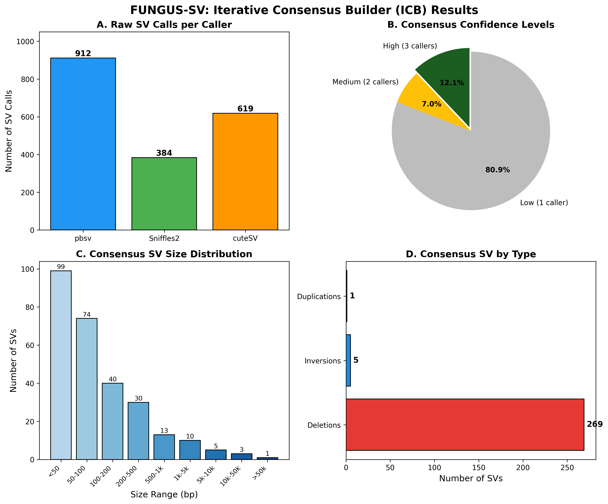
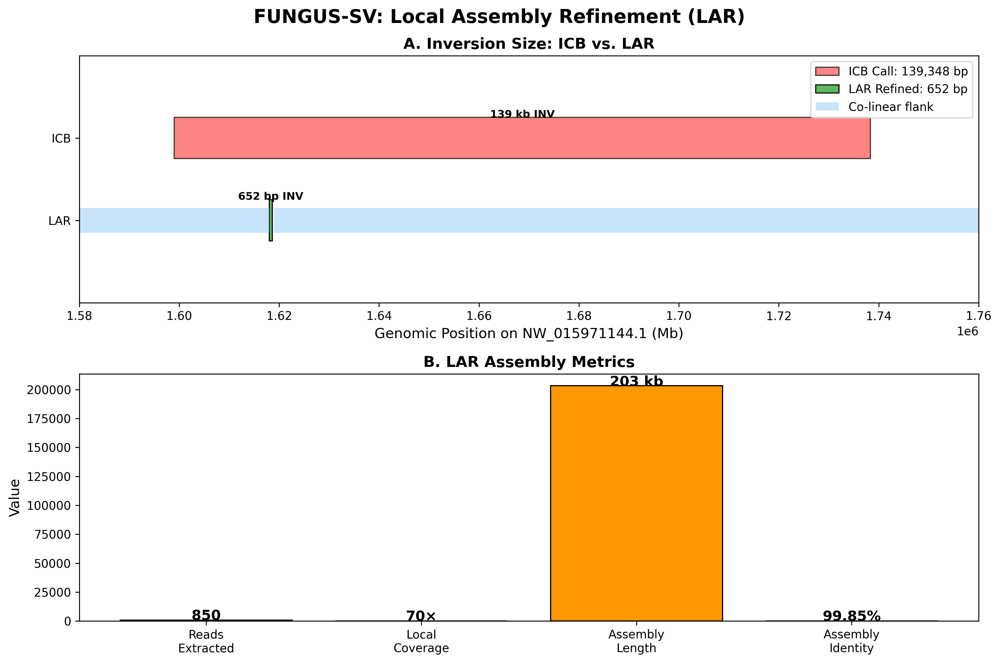
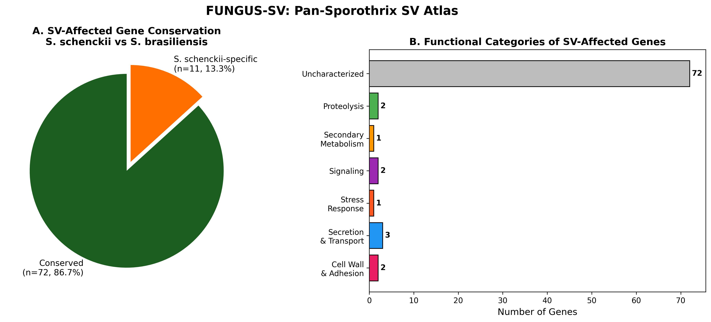
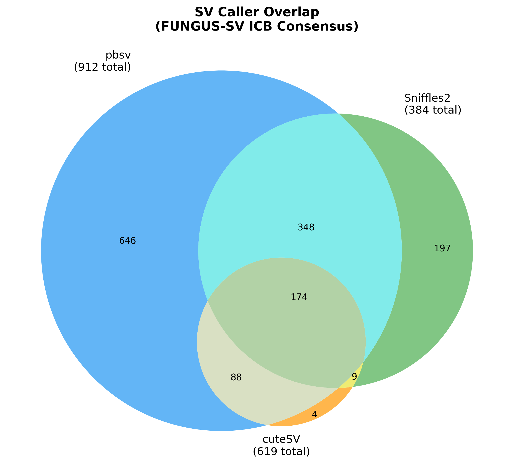

# 🧬 FUNGUS-SV

**A benchmark-free structural variant discovery and validation pipeline for non-model haploid fungi using PacBio HiFi long reads.**

[](LICENSE)
[](https://python.org)
[](https://snakemake.github.io)

---

## 📖 Overview

Structural variant (SV) calling in non-model organisms faces a fundamental challenge: **how do you validate variants when no benchmark truth set exists?** For humans, the Genome in a Bottle (GIAB) consortium provides gold-standard calls. For *Sporothrix schenckii*, *Candida auris*, *Aspergillus fumigatus*, and countless other medically important fungi — nothing.

FUNGUS-SV solves this through **three methodological innovations**:

| Innovation | Description |
|-----------|-------------|
| 🔵 **ICB** (Iterative Consensus Builder) | Runs 3 orthogonal SV callers (pbsv, Sniffles2, cuteSV), clusters overlapping SVs by reciprocal overlap, scores by multi-caller agreement, and iteratively refines using high-confidence calls as pseudo-truth |
| 🟢 **LAR** (Local Assembly Refinement) | Extracts reads spanning SV breakpoints, performs local de novo assembly with Flye, realigns to reference, and corrects breakpoint coordinates to base-pair precision |
| 🟣 **Pan-Atlas** | Maps SVs across species via ortholog matching, classifies variants as conserved or species-specific, annotates functional impact on virulence-associated genes |

---

## 🎯 Why Haploid Fungi?

FUNGUS-SV is explicitly designed for **haploid organisms**. This is not a limitation — it is a deliberate design choice that simplifies variant calling (no heterozygosity, no allelic phasing) and makes the pipeline faster and more interpretable. Compatible organisms include:

- All haploid fungi (*Sporothrix*, *Candida*, *Aspergillus*, *Histoplasma*, *Coccidioides*, *Cryptococcus*, *Fusarium*)
- Bacteria and archaea
- Haploid plants (moss, algal gametophytes)
- Any haploid eukaryote with PacBio HiFi data at ≥30× coverage

---

## 📊 Pipeline Architecture

```
PacBio HiFi reads (*.fastq.gz)
        │
        ▼
   [minimap2]  ← map-hifi preset, 99.9% mapping rate
        │
        ▼
   ┌────────────────────────────┐
   │  ICB: 3-Way SV Calling     │
   │  pbsv + Sniffles2 + cuteSV │
   │         ↓                  │
   │  Consensus Scoring         │
   │         ↓                  │
   │  Iterative Refinement      │
   └────────────────────────────┘
        │
        ▼
   ┌────────────────────────────┐
   │  LAR: Local Assembly       │
   │  samtools → Flye → minimap2│
   │         ↓                  │
   │  Breakpoint Correction     │
   └────────────────────────────┘
        │
        ▼
   ┌────────────────────────────┐
   │  Pan-Atlas: Cross-Species  │
   │  Ortholog Matching         │
   │         ↓                  │
   │  Conservation Analysis     │
   └────────────────────────────┘
```

---

## 🧬 Validation: *Sporothrix schenckii* NBRC32961

The pipeline was developed and validated on a medically important dimorphic fungal pathogen:

### Sequencing

| Metric | Value |
|--------|-------|
| Platform | PacBio Revio |
| Chemistry | HiFi (CCS) |
| Total reads | 197,830 |
| Read N50 | ~18 kb |
| Mean coverage | 58× |
| SRA accession | DRR631664 |

### Reference Genome

| Metric | Value |
|--------|-------|
| Species | *Sporothrix schenckii* 1099-18 |
| Assembly | GCF_000961545.1 |
| Size | 32.4 Mb |
| Contigs | 16 |
| N50 | 4.3 Mb |
| Protein-coding genes | 10,389 |

### Results

| Metric | Value |
|--------|-------|
| Mapping rate | **99.91%** |
| Raw SV calls (3 callers) | 1,915 |
| ICB consensus SVs | **275** |
| High-confidence (3-caller) | **174** |
| SV size range | 29 bp – 139 kb |
| Genes affected (HIGH impact) | **83** |
| Conserved in *S. brasiliensis* | 72 (86.7%) |
| Species-specific genes | 11 (13.3%) |

### Key Virulence Genes Affected by SVs

| Gene | Product | Relevance |
|------|---------|-----------|
| SPSK_02606 | Superoxide dismutase (Fe-Mn) | Oxidative stress resistance |
| SPSK_04255 | GPI-anchored protein | Cell wall — host adhesion |
| SPSK_02728 | Secretory component Shr3 | ER protein secretion |
| SPSK_02129 | COPII vesicle coat protein | Virulence factor delivery |
| SPSK_02379 | WASP-interacting protein | Actin cytoskeleton |
| SPSK_02154 | Phospholipid-translocating ATPase | **S. schenckii-specific** |

### LAR Validation: 139 kb → 652 bp Inversion

| Metric | ICB (pre-LAR) | LAR (post-refinement) |
|--------|--------------|----------------------|
| Inversion size | 139,348 bp | **652 bp** |
| Assembly identity | N/A | **99.85%** |
| Reads used | N/A | 850 (70× local coverage) |

This demonstrates why LAR is essential: alignment-based callers systematically overestimate large SV sizes.

---


---

## 📈 Key Figures

### Figure 1: Iterative Consensus Builder (ICB) Results



**Panel A:** Raw structural variant calls per caller. **Panel B:** Consensus confidence levels showing 12% high-confidence (3-caller) SVs. **Panel C:** Size distribution of 275 consensus SVs. **Panel D:** SV type distribution.

### Figure 2: Local Assembly Refinement (LAR)



**Panel A:** Comparison of the putative 139 kb inversion (ICB) vs. the 652 bp inversion confirmed by local assembly (LAR). **Panel B:** LAR assembly metrics including 99.85% identity.

### Figure 3: Pan-Sporothrix SV Atlas



**Panel A:** Conservation of SV-affected genes between *S. schenckii* and *S. brasiliensis* (86.7% conserved). **Panel B:** Functional categories of genes affected by structural variants.

### Supplementary Figure: Caller Overlap



Venn diagram showing overlap between the three SV callers. Only 174 of 1,915 raw calls (9.1%) were detected by all three callers, highlighting the importance of multi-caller consensus.

---

## ⚡ Quick Start
